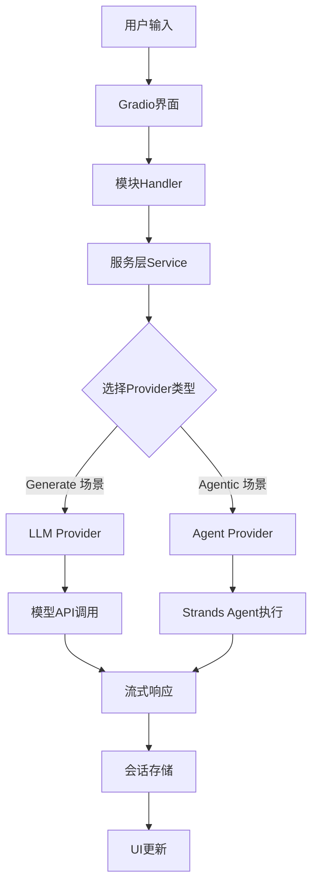
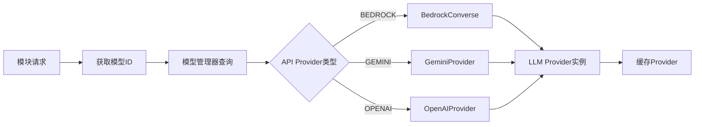
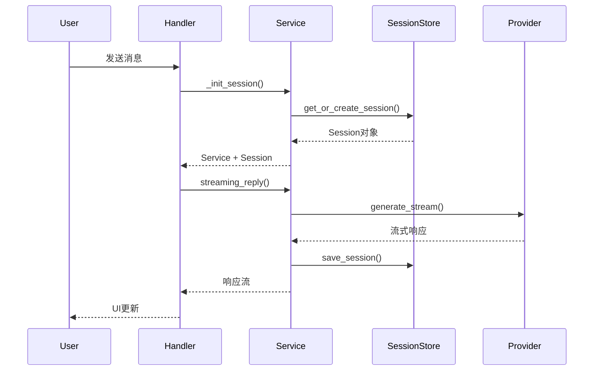
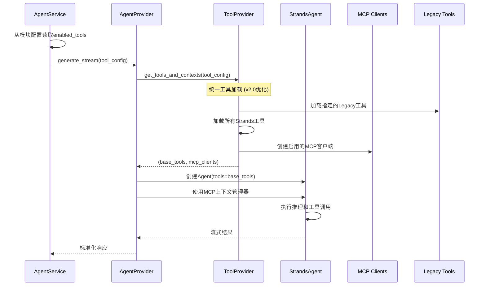

# MyAIBOX 架构和数据流程文档

## 📋 文档概述

本文档详细描述了MyAIBOX的多层架构设计、组件关系和数据流程。

**版本**: v2.0
**适用范围**: 全栈开发、模块增强、系统维护
**文档维护**: 请在修改架构或添加新功能时及时更新此文档。

---

## 🏗️ 系统架构概览

MyAIBOX采用分层架构设计，从上到下分为5个主要层次：

```
┌─────────────────────────────────────────────────────────────┐
│                    应用层 (Application Layer)                │
│  FastAPI + Gradio + 认证中间件 + CORS + 会话管理              │
│  app.py                                                     │
└─────────────────────────────────────────────────────────────┘
                                │
┌─────────────────────────────────────────────────────────────┐
│                    模块层 (Module Layer)                     │
│  Assistant │ Persona │ Vision │ Text │ Draw │ Coding │ ...   │
│  BaseHandler[ServiceType] 泛型模式                           │
└─────────────────────────────────────────────────────────────┘
                                │
┌─────────────────────────────────────────────────────────────┐
│                    服务层 (Service Layer)                    │
│  ChatService │ DrawService │ GenService │ AgentService      │
│  ServiceFactory 工厂模式                                     │
└─────────────────────────────────────────────────────────────┘
                                │
┌─────────────────────────────────────────────────────────────┐
│                   GenAI层 (GenAI Layer)                     │
│  LLM Providers         Agent Providers       Tool Provider  │
│  • BedrockConverse     • AgentProvider                      │
│  • BedrockInvoke       • Strands Integration                │
│  • GeminiProvider                                           │
│  • OpenAIProvider                                           │
└─────────────────────────────────────────────────────────────┘
                                │
┌─────────────────────────────────────────────────────────────┐
│                 基础设施层 (Infrastructure Layer)             │
│  配置管理 │ 会话存储 │ 工具集成 │ AWS服务 │ 日志系统          │
│  DynamoDB │ Cognito │ MCP Tools │ Legacy Tools              │
└─────────────────────────────────────────────────────────────┘
```

## 🔧 核心组件详解

### 1. 应用层 (Application Layer)

**文件**: `app.py`

**职责**:
- FastAPI应用初始化和生命周期管理
- Gradio界面集成和路由配置
- 认证中间件和会话管理
- CORS配置和安全策略

**关键组件**:
```python
# 应用生命周期管理
@asynccontextmanager
async def lifespan(app: FastAPI):
    # 启动时初始化模型管理器
    model_manager.init_default_models()
    yield
    # 关闭时清理资源

# 中间件栈
SessionMiddleware -> CORSMiddleware -> 认证依赖
```

**数据流**:
```
HTTP请求 -> 会话验证 -> 路由分发 -> Gradio界面 -> 模块处理
```

### 2. 模块层 (Module Layer)

**目录**: `modules/`

**设计模式**: BaseHandler泛型模式

**核心抽象**:
```python
class BaseHandler(Generic[ServiceType]):
    _service: Optional[ServiceType] = None
    _module_name: str = "base"
    
    @classmethod
    async def _get_service(cls) -> ServiceType
    @classmethod
    async def _init_session(cls, request: gr.Request)
    @classmethod
    def _normalize_input(cls, ui_input: Union[str, Dict]) -> Dict
```

**模块结构**:
```
modules/
├── assistant/          # AI助手 (ChatService)
├── persona/           # 角色聊天 (ChatService)  
├── vision/            # 视觉识别 (GenService)
├── text/              # 文本处理 (GenService)
├── draw/              # 图像生成 (DrawService)
├── coding/            # 代码生成 (GenService)
├── deepsearch/        # 深度搜索 (AgentService)
└── asking/            # 问答思考 (GenService)
```

**每个模块包含**:
- `handlers.py`: 业务逻辑处理器
- `ui.py`: Gradio界面定义
- `prompts.py`: 系统提示词

### 3. 服务层 (Service Layer)

**目录**: `core/service/`

**设计模式**: 工厂模式 + 基类继承

**模块到服务的映射**

```
┌─────────────┐     ┌─────────────────┐
│  Assistant  │────▶│  AgentService   │  ← 工具调用和复杂推理
└─────────────┘     └─────────────────┘

┌─────────────┐     ┌─────────────────┐
│   Persona   │────▶│  ChatService    │  ← 多轮对话
└─────────────┘     └─────────────────┘

┌─────────────┐     ┌─────────────────┐
│ DeepSearch  │────▶│  AgentService   │  ← 深度搜索和工具调用
└─────────────┘     └─────────────────┘

┌─────────────┐     ┌─────────────────┐
│    Draw     │────▶│  DrawService    │  ← 图像生成
└─────────────┘     └─────────────────┘

┌─────────────┐     ┌─────────────────┐
│    Text     │────▶│  GenService     │  ← 通用内容生成
│   Vision    │────▶│  GenService     │
│   Coding    │────▶│  GenService     │
│   Asking    │────▶│  GenService     │
└─────────────┘     └─────────────────┘
```

**服务类型说明**:
- **ChatService**: 多轮对话服务，专注于会话历史管理
- **GenService**: 通用内容生成服务，适用于单轮任务
- **DrawService**: 图像生成专用服务，支持多种生成模型
- **AgentService**: 支持工具调用的智能代理服务，使用Strands Agent框架

### 4. GenAI层 (GenAI Layer)

**目录**: `genai/`

**核心特点**: LLM Provider 和 Agent Provider 是**并列关系**，服务层根据需求选择其中一种构建服务。

#### 4.1 LLM Providers (模型提供者)

**目录**: `genai/models/providers/`

**接口定义**:
```python
class LLMAPIProvider(ABC):
    def __init__(self, model_id: str, llm_params: LLMParameters, tools: List[str])
    
    @abstractmethod
    async def generate_content(self, messages, system_prompt) -> LLMResponse
    
    @abstractmethod
    async def generate_stream(self, messages, system_prompt) -> AsyncIterator[Dict]
    
    @abstractmethod
    async def multi_turn_generate(self, message, history, system_prompt) -> AsyncIterator[Dict]
```

**实现类**:
- `BedrockConverse`: AWS Bedrock Converse API
- `BedrockInvoke`: AWS Bedrock Invoke API  
- `GeminiProvider`: Google Gemini API
- `OpenAIProvider`: OpenAI API

**工厂函数**:
```python
def create_model_provider(provider_name: str, model_id: str, llm_params: LLMParameters, tools: List[str]) -> LLMAPIProvider
```

#### 4.2 Agent Providers (代理提供者)

**目录**: `genai/agents/`

**核心类**:
```python
class AgentProvider:
    def __init__(self, model_id: str, system_prompt: str = '')
    def _get_strands_model(self) -> Union[BedrockModel, OpenAIModel]
    async def generate_stream(self, prompt: str, tool_config: Dict) -> AsyncIterator[Dict]
```

**集成框架**: Strands Agent Framework
- 支持工具调用和复杂推理
- 统一的工具管理接口
- 流式响应和错误处理

#### 4.3 模型管理

**文件**: `genai/models/model_manager.py`

**功能**:
- 模型注册和发现
- 能力匹配和筛选
- 配置管理和缓存

**模型定义**:
```python
@dataclass
class LLMModel:
    name: str
    model_id: str
    api_provider: str
    category: str
    capabilities: LLM_CAPABILITIES
```

### 5. 基础设施层 (Infrastructure Layer)

#### 5.1 配置管理 (`core/config.py`)
```python
class ENVConfig:
    @property
    def aws_region(self) -> str
    @property
    def cognito_config(self) -> dict
    @property
    def database_config(self) -> dict
    @property
    def bedrock_config(self) -> Dict[str, str]

class AppConfig:
    @property
    def server_config(self) -> Dict[str, Any]
    @property
    def cors_config(self) -> Dict[str, Any]
    @property
    def security_config(self) -> Dict[str, Any]
```

#### 5.2 会话管理 (`core/session/`)

**核心组件**:
```python
# 会话数据模型
@dataclass
class Session:
    session_id: str
    user_name: str
    created_at: datetime
    updated_at: datetime
    metadata: Dict[str, Any]
    
# 会话存储接口
class SessionStore(ABC):
    @abstractmethod
    async def get_session(self, session_id: str) -> Optional[Session]
    @abstractmethod
    async def save_session(self, session: Session) -> None
    @abstractmethod
    async def delete_session(self, session_id: str) -> None

# 持久化（基于DynamoDB实现）
class DynamoDBSessionStore(SessionStore):
    def __init__(self, table_name: str, region: str)
```

**缓存策略**:
- **内存缓存**: 10分钟TTL，减少数据库查询
- **持久化存储**: DynamoDB，支持跨会话数据保持
- **自动清理**: 定期清理过期会话和缓存

**会话生命周期**:
1. **创建**: 用户首次访问时自动创建
2. **更新**: 每次交互后更新时间戳和元数据
3. **缓存**: 活跃会话保存在内存中
4. **持久化**: 定期同步到DynamoDB
5. **清理**: TTL过期后自动清理


#### 5.3 工具集成 (`genai/tools/`)

**统一工具系统** (v2.0优化):

MyAIBOX采用统一的工具系统，支持三种工具类型：

| 工具类型 | 配置方式 | 使用场景 |
|---------|---------|---------|
| **Legacy Tools** | 模块配置界面 | 简单功能，模块特定 |
| **Strands Tools** | 固定启用 | 基础功能，全局可用 |
| **MCP Tools** | Tool Management界面 | 复杂功能，外部服务 |

**功能特性**:
- 按需加载MCP客户端
- 智能工具过滤
- 原生Strands集成

**核心架构**:
```
ToolProvider (统一入口)
├── Legacy Tools    (Python函数 + @tool装饰器)
├── Strands Tools   (SDK原生工具)
└── MCP Tools       (外部服务，按需连接)
```

**配置格式**:
```python
tool_config = {
    'enabled': True,
    'legacy_tools': ['get_weather', 'generate_image'],
    'mcp_tools_enabled': True,
    'strands_tools_enabled': True,
}
```

详细信息请参考: [工具系统架构文档](./tool-system-architecture.md)

---

## 🔄 数据流程

### 1. 用户请求处理流程



### 2. 模型选择和Provider创建



### 3. 会话生命周期



### 4. 工具调用流程 (Agent模式)



**v2.0优化特性**:
- **配置驱动**: 工具加载完全基于配置，避免硬编码
- **按需创建**: MCP客户端只在需要时创建，减少启动时间
- **统一接口**: ToolProvider提供统一的工具获取接口
- **上下文管理**: 使用Strands原生的MCP上下文管理

---

## 📊 关键设计决策

### 1. 服务层设计原则

**单一职责**: 每个服务专注特定功能领域
- ChatService: 多轮对话和历史管理
- AgentService: 工具调用和复杂推理  
- DrawService: 图像生成和处理
- GenService: 通用内容生成

**依赖注入**: 通过工厂模式创建服务实例
```python
# 模块层通过泛型指定服务类型
class AssistantHandlers(BaseHandler[ChatService]):
    pass

# 服务工厂根据类型创建实例
service = ServiceFactory.create_chat_service("assistant")
```

### 2. GenAI层并列架构

**设计理念**: LLM Provider和Agent Provider是并列关系，而非层级关系

**选择逻辑**:
- **简单对话**: 使用LLM Provider (ChatService)
- **工具调用**: 使用Agent Provider (AgentService)
- **图像生成**: 使用LLM Provider (DrawService)
- **文本处理**: 使用LLM Provider (GenService)

**优势**:
- 清晰的职责分离
- 独立的优化和扩展
- 灵活的模型选择策略

### 3. 会话管理策略

**缓存机制**: 内存缓存 + 数据库持久化
```python
# 10分钟TTL的会话缓存
self._session_cache: Dict[str, tuple[Session, float]] = {}
```

**上下文管理**: 24条消息的滑动窗口
```python
# ChatService中的历史截断
_max_context_messages: int = 24
```

**状态同步**: UI状态与会话状态的双向同步

---

## 📚 相关文档

- [工具系统架构](./tool-system-architecture.md) - 详细的工具系统设计和使用指南
- [Strands Agents SDK参考](./strands-agents-sdk-reference.md) - Strands框架集成文档
- [工具管理评估](./tool-management-evaluation.md) - 工具管理系统评估
